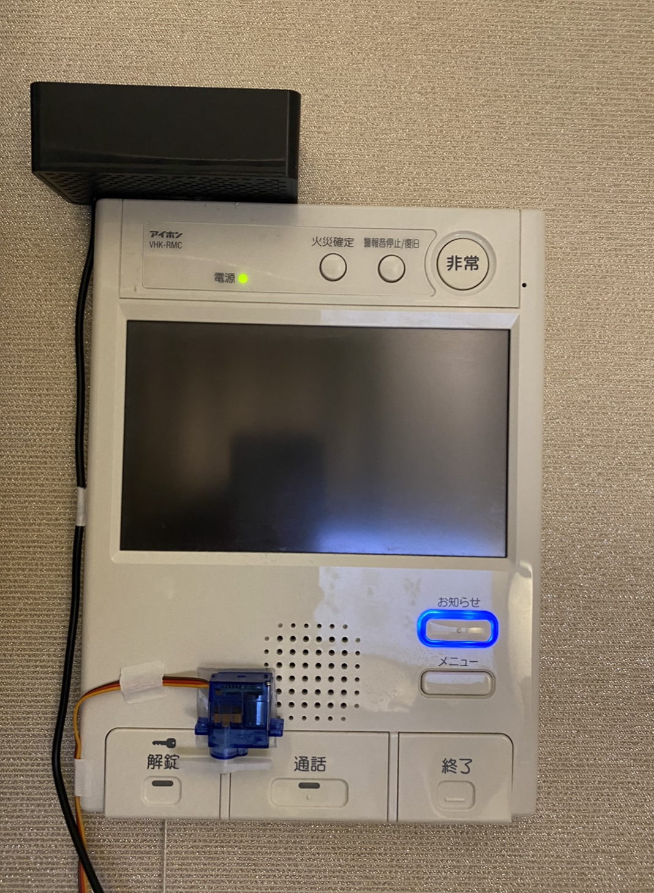
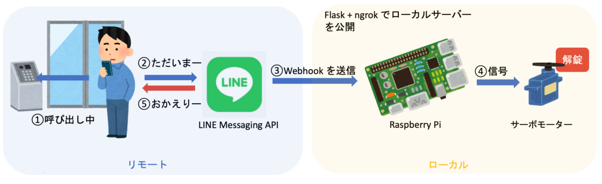
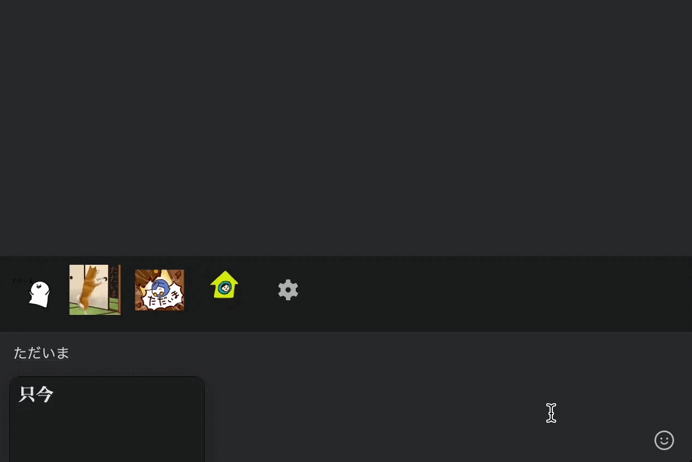
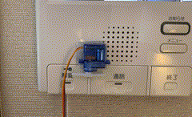

# おかえり！Push

## 製品概要
1. 疲れて帰宅した中、”ただいま”と返すと"おかえり!"と言ってくれて、マンションのオートロックを開けてくれるLINE Bot
2. 不在中に配達が来たら、カメラで誰が来たかを確認した後、オートロックを開けて、置き配ができるようにするシステム(開発中（Hack Dayの2日間では実装できませんでした。)

### 背景
疲れて帰宅した中、"おかえり!"と返してくれると嬉しいですよね！
でも、一人暮らしをしていると、そんなことを言ってくれる人は誰もいません。
我々は、そんな寂しい一人暮らしの人のために、LINEから”ただいま"と送れば、"おかえり！"と返してくれて、さらにマンションのオートロックを開けてくれるLINE Botを作りました。
誰でも持っているであろうRaspberryPiがあれば、簡単に開発ができます。

さらに、我々は、不在中にマンションのオートロックが開けられず玄関先に置き配をしたくてもできないという問題点に着目しました。

*令和5年度の宅急便の再配達は、おおよそ10件に1件です。*

その中でも、マンションのオートロックが開かず置き配したくてもできないというケースは多いです。
マンションの宅配Boxは普及してきていますが、全て埋まっている割合が多く、その場合は、玄関先に置き配をしたくてもできません。

そこで、自分の再配達だけでも減らして配達業者の労力を減らしたいと思い、インターホンにwebカメラを設置して、誰が来たかをLINEに通知することで、不在中にオートロックを開けれるシステムの開発を懸命に進めています。

Hack Dayの2日間で開発できた部分は、LINEから”ただいま"と送ると、"おかえり！"と返してくれる部分だけですが、現在は、置き配ができるようなシステムの開発も進めている最中です。

### システム概要構成
僕のマンションのインターホンは、通話ボタンを押した後に解錠ボタンが押されると、オートロックが開くタイプのものです。

エントランスで、自分の部屋番号を呼び出している時に、LINE Botに「ただいま」と送信すると、LINE Messaging APIを通して、RaspberryPiは、LINEに「おかえり！」と返します。
さらに、RaspberryPiのGPIOに繋がれたサーボモーターを制御して、オートロックを開けてくれます。
通話中に、RaspberryPiに接続されたスピーカーから「おかえり！」と言ってくれるので、テキストと音声の両方で「おかえり！」と言ってくれます。

実際に、おかえり！Pushに「ただいま」と送ってみます！

すると、サーボモーターが動いて、オートロックが開きます。さらに、スピーカーから「おかえり！」と言ってくれます。

そして、LINEを見ると、「おかえりなさいませ！」というメッセージを返してくれました。

#### 1. 特長 1
返してくれる音声は、カスタマイズ可能です！
"音読さん”などのwebサービスを使って、好きに音声フェイルを生成することができます。
#### 2. 特長 2
LINE Messaging APIを使った特徴は、LINEでただいまと返してくれるので、生身感がでます。

### 解決出来ること

- 一人暮らしの人の寂しさを解消することができます！
- さらに、僕は、鍵を忘れる場合が多いのですが、そんな時も、スマホからオートロックを開けることができます。

### 今後の展望

今後は、RaspberryPiにUSBカメラとマイクを接続して、インターホンの音を検知した時に、カメラで誰が来たかを撮影して、LINEに通知することで、不在中にオートロックを開けるシステムを完成させたいと思います。

インターホンの音をスペクトル解析を行った結果、900Hzの倍数の音をピークに取っていたことから、ラズパイのマイクでFFTを行い、最大振幅の周波数を取得して、その周波数が900Hz、２倍音、３倍音・・・の周辺であればインターホン音と識別しようと試行錯誤しています。

## 開発技術

### 活用した技術

#### API・データ

- LINE Messaging API

#### フレームワーク・ライブラリ・モジュール

- Flask
- ngrok

#### デバイス

- RaspberryPi

### 独自技術

#### ハッカソンで開発した独自機能・技術

- 独自で開発したものの内容をこちらに記載してください
- 特に力を入れた部分をファイルリンク、または commit_id を記載してください。

#### 製品に取り入れた研究内容（データ・ソフトウェアなど）（※アカデミック部門の場合のみ提出必須）

-
-
