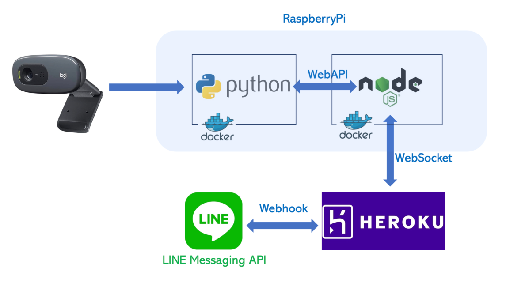

# おかえり！Push


## セットアップ(RaspberryPi+usbマイク+usbカメラが必要)

```bash
export LINE_CHANNEL_SECRET=YOUR_LINE_CHANNEL_SECRET
export LINE_CHANNEL_ACCESS_TOKEN=YOUR_LINE_CHANNEL_ACCESS_TOKEN
sudo apt-get update
sudo apt-get install tmux -y
tmux

#session1 (Notify.pyを実行)
sudo apt-get install portaudio19-dev
sudo apt-get install libopenblas-dev
sudo apt-get install python3-pandas
source myenv/bin/activate
pip install -r requirements.txt
python Notify.py

#session2 (Unlocker.pyを実行)
sudo pigpiod
python Unlocker.py

#session3 (ngrokを起動)
unzip ngrok-stable-linux-arm.zip
chmod +x ngrok
sudo mv ngrok /usr/local/bin/
ngrok authtoken YOUR_AUTHTOKEN
ngrok http 8000

```


スイッチングはサーボモータもしくはswithBotAPIを使用。
スピーカーを接続することで、音声でも”おかえり"と言わせることができます。

## 製品概要

記事:
https://zenn.dev/yukitezuka/articles/1985fc12052e5a

毎晩疲れて帰宅した中、"ただいま"と送れば、"おかえり！"と返してくれてマンションのオートロックを開けてくれるLINE Bot。
さらに、不在中に宅急便が来た際に、オートロックを開けて置き配をしてくれるように、インターホンの音が鳴ったらLINE Notifyで訪問者の画像を送信する機能も備えています。インターホンの音はFFTを行い、認識するプログラムを実装しました。

### 背景
再配達を撲滅したかった。


再配達の連絡はめんどくさい。

オートロックがあるマンションだと、不在中に置き配してほしくても開けれずに持ち帰られてしまう。そんなわけで、宅配業者が来たら、遠隔でオートロックを開けれるようなシステムを作ろうと思った。


### 製品説明

#### 特長 1

まずは、インターホン音をFFT(高速フーリエ変換)して、インターホン音のみを認識するプログラムを作成.


使い方: `check_dev_id.py`でRaspberryPiに接続されているマイクのデバイス番号を取得.
`record.py`を実行してインターホンの音を録音. `output.wav`に保存される.
jupyternotebook`FFT.opynb`で、録音した音声をplotし、fftを行い、検出に使うデータ点を決める.
インターホンの音のみを検出するように、`test_detector.py`を実行しながらエンジニアリング.
gitで、RaspberryPiとMacのjupyternotebookを同期させて開発をしました.

`test_notifier.py`を実行すると、インターホンの音が検出されるとLINE Notifyに通知が来ます.

#### 特長 2

`Notify.py`:インターホンの音を認識すると接続されたwebカメラで撮影を行い、LINE notifyに通知させます.

AppleWachをつけておけば、LINEの通知で誰が来たかを瞬時に確認できる.

#### 特長 3

`Unlocker.py`:テキストに応じて、インターホンを開錠し、スピーカーでアナウンスします.

### 解決出来ること

戸建用は、スマホでインターホンの応答ができるスマートドアベルが売られており、独自に設置できる。しかしながら、集合住宅では設置は不可能である。そのような問題を解決するべく、RaspberryPiで外付けで解決した。


### 今後の展望

- opencvでモニター部分を射影変換して、見やすくする。

- 現在は、LINE Notifyでインターホンの画像を確認した後に、LINE Botに開ける指示を送らなければいけなく、2度手間である。LINE Botで画像の送信を行い、LINE Botでアクション選択を促すことで、LINE Botだけで完結させたい。


- 置き配はすぐ手配しなければいけないので、ほとんどの宅配はあらかじめタイムスケジュールを設定しておき、通知しなくても開けれるようにしたい。

- 将来的には、インターホンがなると、スマホに着信してエントランスと対話できるようなアプリケーションを作りたい。

- 今回開発したデバイスはあくまで、自分の再配達を撲滅したいということで、ニッチで利己的な目的で作成したが、マス向けにセキュリティ面を強化したアプリを開発して、オートロックによる再配達を減らしたい。(ちなみに、今年度の再配達率は
*12%*
だそう。)
## 開発技術

### 活用した技術

#### API・データ

- LINE Messaging API
- LINE Notify API
- ngrok

#### フレームワーク・ライブラリ・モジュール

- Flask
- pyaudio
- opencv

#### デバイス

- RaspberryPi4

### 独自技術

#### ハッカソンで開発した独自機能・技術

- インターホンの音をFFT(高速フーリエ変換)し、高音域の周波数を足し合わせることで閾値を調節し、低音の生活音に誤反応することなく、インターホンの音だけを認識させることに成功した。
- 

#### 製品に取り入れた研究内容（データ・ソフトウェアなど）（※アカデミック部門の場合のみ提出必須）

-
-

### 


